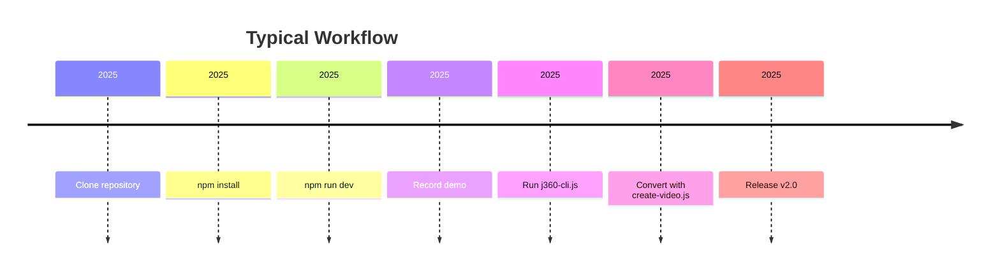
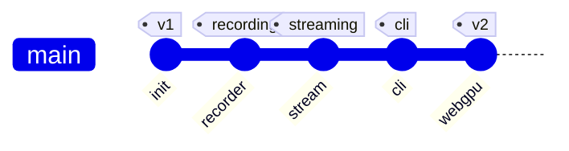

# Repository Diagrams

This document provides a visual overview of how J360 components fit together. Diagrams use [Mermaid](https://mermaid.js.org/) syntax and can be rendered directly on GitHub.

## Capture Flowchart

This chart summarizes the recording paths described in [README.md](../README.md).

## CLI Sequence Diagram

The sequence is based on [tools/j360-cli.ts](../tools/j360-cli.ts).

## Class Relationships

Methods shown above are defined in [src/j360.ts](../src/j360.ts).

## Development Timeline

## Gitgraph

